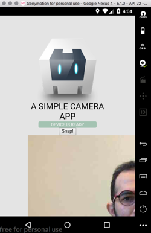

## Steps

I used Genymotion to emulate android device and used mac webcam as back camera in Genymotion

```bash
npm install -g cordova
cordova create showimage
cordova platform add android
cordova plugin add cordova-plugin-camera
cordova run android
```
